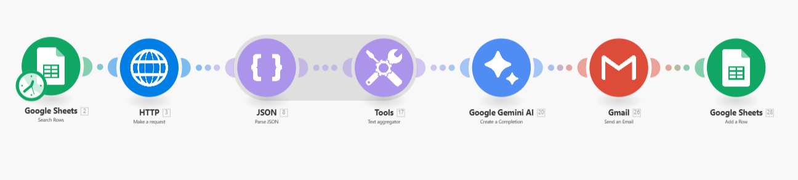

# 🏨 Hotel Reviews Reporter

An automation system built with **Make.com** that collects Google Reviews for hotels, processes them with **Google Gemini AI**, and emails a **weekly summary report** (ratings, reviews, sentiment analysis, improvement suggestion, and reply draft).  

MVP is designed to be **low-cost, lightweight, and fast to production** – no dashboards, no PMS/OTA integrations, just automated email reports.

---

## Project Structure

```
Hotel_Reviews_Reporter/
├── docs/
│   ├── Flow_Diagram.png              # Visual overview of the Make.com scenario
│   └── AI_review_reports.md          # Excel containing properties and work log
│
├── examples/
│   ├── google_review.json            # Sample raw Google Review API output
│   └── Weekly Review Report – The Ritz-Carlton, Pune.eml  # Example of final email
│
├── make_scenario/
│   └── Hotel_Reviews_Reporter.blueprint  # Exported Make.com scenario (JSON blueprint)
│
├── LICENSE                           # License file (MIT or chosen license)
├── README.md                         # Project overview & documentation (this file)
└── sample_env                        # Example of required environment variables (API keys)
```

---

## 1) Purpose & Goal 

Once a week, each active property receives an email containing:

- Current **average rating** and **total number of reviews** on Google Reviews  
- An **AI-generated summary of latest 5 review** (2–3 sentences)  
- **1 actionable improvement suggestion**  
- **1 suggested reply** to a guest review  

Output: simple, useful, fast → email only.  

---

## 2) Tech Stack

- **Orchestration:** [Make.com](https://www.make.com/)  
- **Input database:** Google Sheets  
- **Data source:** Google Maps / Places API (reviews & rating)  
- **AI:** Google Gemini (`gemini-flash`)  
- **Delivery:** Gmail (Google Workspace) – “Send email”  

---

## 3) Google Sheet Structure

**Tab `properties`**  

| property_id | name | report_email | google_maps_url | google_place_id | report_language | active |
|-------------|------|--------------|-----------------|-----------------|-----------------|--------|
| Unique ID   | Hotel name | Recipient email | Google Maps link | Place ID | en/de/it/sl | TRUE/FALSE |

**Tab `runs_log`**  

| timestamp | property_id | source | new_reviews_count | avg_rating | email_status | notes |
|-----------|-------------|--------|-------------------|------------|--------------|-------|
| ISO time  | property ref | google | # reviews pulled  | avg rating | SENT/ERROR   | error msg if any |

---

## 4) Make – Scenario (cron 1×/week)

**A. Trigger**  
- Scheduler: every Friday 07:00 CET  
- Google Sheets → Search Rows (filter `active = TRUE`)  

**B. For each property (Iterator)**  

   1. **Google Reviews** (HTTP → Places API)  
   - Pull avg rating, total ratings, last 3 reviews  

   2. **Normalize reviews**  
   - Format: `(author, rating★ – date): text`  
   - Remove emojis/extra whitespace  
   - Truncate >800 chars  

   3. **Gemini AI – Summary + Suggestions**  
   - System prompt: *“You are a hospitality reputation analyst. Output in {{report_language}}.”*  
   - User prompt:
     ```
     Hotel: {{name}}
     Avg rating and Reviews count:
     {{avg_rating, google_total}}

     Tasks:
     1. Summarize guest sentiment in 2–3 sentences.
     2. Suggest 1 actionable improvement.
     3. Draft a polite reply for 1 review.
     ```  

   4. **Compose Email** (Tools → Compose String, HTML mode)  
   - Subject: `Weekly AI Review Report – {{name}}`  
   - Body: ratings, reviews, AI analysis  

   5. **Gmail – Send Email**  
   - To: `report_email`  
   - Body: HTML  

   6. **Log run in Google Sheets (`runs_log`)**  
   - `timestamp = now`  
   - `property_id`  
   - `source = google`  
   - `new_reviews_count`  
   - `review_content`  
   - `email_status = SENT / ERROR`  
---

## 5) Email Template (HTML)

**Subject:**  
`Weekly AI Review Report – {{name}}`  

**Body (HTML example):**  

```html
   <p>Hello,</p>
   <p>Here is your weekly summary of new public reviews:</p>

   <p><strong>Ratings</strong><br/>
   Google: {{google_avg}} ★ ({{google_total}} reviews)</p>

   <p><strong>AI Summary</strong><br/>
   {{summary}}</p>

   <p><strong>AI Improvement Suggestion</strong><br/>
   {{improvement}}</p>

   <p><strong>Reply Suggestion</strong><br/>
   {{reply_suggestion}}</p>
```
---

## 6) Cost Estimate (Free Tier, 10 properties)

- **Gemini API:** free/low tier (until quota hit)  
- **Google Places API:** few € / month  
- **Make.com:** Core plan (~€9–29 / month)  
- **Gmail:** included with Google Workspace  

---

## 7) Automated flow structure

- Every Friday at 07:00 CET → each active property gets an email  
- Email includes:  
  - Google average rating & total reviews  
  - Last 3 reviews  
  - AI summary (2–3 sentences)  
  - 1 improvement suggestion  
  - 1 reply draft  
- Log entries created in `runs_log`  
- Errors logged + alert sent  

---

## 8) Future Upgrades

- Add **Booking.com** (via Apify Actor)  
- Add **TripAdvisor** reviews  
- Add **Looker Studio dashboard** with trends  
- Daily frequency or instant alerts for negative reviews  
- Automated replies (draft + post via API)  

---

## 9) Developer Notes

- `report_language` controls AI output (default = `en`)  
- Deduplicate reviews via `(source + author + date + first 40 chars)`  
- Reviews truncated to 600–800 chars in emails  
- GDPR: only public review data, no guest emails stored  
- API keys stored in Make Encrypted Variables  

---

## 10) Flow Diagram

